# Diagrama de Secuencia - Flujo del Juego Multiplayer Bingo

## Descripción
Este diagrama muestra el flujo completo del juego desde que el usuario abre la app hasta que regresa al lobby después de un juego.

## Diagrama de Secuencia

```mermaid
sequenceDiagram
    actor Usuario
    participant Index as Index Screen
    participant Lobby as Lobby Screen
    participant Context as BingoGameContext
    participant Hook as useBingoGame
    participant Waiting as Waiting Room
    participant Game as Game Screen
    participant Modal as Winner Modal

    %% FASE 1: INICIO Y LOBBY
    Usuario->>Index: Abre la app
    activate Index
    Index->>Usuario: Muestra pantalla bienvenida
    Usuario->>Index: Click "Ir al Lobby"
    Index->>Lobby: router.push('/lobby')
    deactivate Index

    activate Lobby
    Lobby->>Context: useBingoGameContext()
    Context->>Hook: Obtiene estado del juego
    Hook-->>Context: playerCredits=10, gameState='lobby'
    Context-->>Lobby: Estado del juego
    Lobby->>Usuario: Muestra créditos (10) y botón "Jugar Ahora"

    %% FASE 2: INICIAR MATCHMAKING
    Usuario->>Lobby: Click "Jugar Ahora"
    Lobby->>Context: initiateMatchmaking()
    Context->>Hook: Valida créditos >= 2
    Hook->>Hook: setPlayerCredits(10 - 2 = 8)
    Hook->>Hook: setGameState('waiting')
    Hook->>Hook: setPlayersInRoom([{id:'player'}])
    Hook-->>Context: success = true
    Context-->>Lobby: Matchmaking iniciado
    Lobby->>Waiting: router.push('/waiting')
    deactivate Lobby

    %% FASE 3: SALA DE ESPERA - MATCHMAKING
    activate Waiting
    Waiting->>Context: useBingoGameContext()
    Context->>Hook: Obtiene estado
    Hook-->>Context: playersInRoom=[player], gameState='waiting'
    Context-->>Waiting: Estado actual
    Waiting->>Usuario: Muestra "1/6 jugadores"
    Waiting->>Usuario: "Buscando jugadores..."

    Note over Waiting,Hook: useEffect() - Simulación de AI uniéndose

    %% AI Opponent 1 se une (500-1000ms)
    Waiting->>Context: setTimeout(500-1000ms)
    Context->>Hook: addAIPlayer(opponent1)
    Hook->>Hook: Verifica créditos opponent[1] >= 2
    Hook->>Hook: Verifica no está en sala
    Hook->>Hook: setOpponentCredits[1] -= 2
    Hook->>Hook: setPlayersInRoom([player, opponent1])
    Hook-->>Context: Opponent 1 agregado
    Context-->>Waiting: playersInRoom.length = 2
    Waiting->>Usuario: "2/6 jugadores" + Lista actualizada

    %% AI Opponent 2 se une (1000-2000ms)
    Waiting->>Context: setTimeout(1000-2000ms)
    Context->>Hook: addAIPlayer(opponent2)
    Hook->>Hook: Verifica y agrega opponent2
    Hook-->>Context: Opponent 2 agregado
    Context-->>Waiting: playersInRoom.length = 3
    Waiting->>Usuario: "3/6 jugadores" + Lista actualizada

    %% AI Opponent 3 se une (1500-2500ms)
    Waiting->>Context: setTimeout(1500-2500ms)
    Context->>Hook: addAIPlayer(opponent3)
    Hook->>Hook: Verifica y agrega opponent3
    Hook-->>Context: Opponent 3 agregado
    Context-->>Waiting: playersInRoom.length = 4
    Waiting->>Usuario: "4/6 jugadores" + Lista actualizada

    %% FASE 4: COUNTDOWN (Mínimo 4 jugadores alcanzado)
    Note over Waiting,Hook: playersInRoom >= 4, inicia countdown

    Waiting->>Waiting: setCountdown(3)
    Waiting->>Usuario: "El juego comienza en... 3"

    Waiting->>Context: setTimeout(1000ms)
    Waiting->>Waiting: setCountdown(2)
    Waiting->>Usuario: "El juego comienza en... 2"

    Waiting->>Context: setTimeout(1000ms)
    Waiting->>Waiting: setCountdown(1)
    Waiting->>Usuario: "El juego comienza en... 1"

    Waiting->>Context: setTimeout(1000ms)
    Waiting->>Waiting: setCountdown(0)

    %% FASE 5: INICIAR JUEGO
    Waiting->>Context: startGame()
    Context->>Hook: Inicia el juego
    Hook->>Hook: totalPlayers = 4
    Hook->>Hook: pot = 4 × 2 = 8 créditos
    Hook->>Hook: setCurrentPot(8)
    Hook->>Hook: setGameState('playing')
    Hook->>Hook: generateBingoCard() para player
    Hook->>Hook: generateBingoCard() × 3 para opponents
    Hook->>Hook: setMarkedCells([FREE_CELL])
    Hook->>Hook: setDrawnNumbers([])
    Hook-->>Context: Juego iniciado
    Context-->>Waiting: gameState='playing'
    Waiting->>Game: router.replace('/game')
    deactivate Waiting

    %% FASE 6: JUEGO EN PROGRESO
    activate Game
    Game->>Context: useBingoGameContext()
    Context->>Hook: Obtiene estado del juego
    Hook-->>Context: bingoCard, gameState='playing', pot=8
    Context-->>Game: Estado completo
    Game->>Usuario: Muestra cartón, pot=8, jugadores=4

    Note over Game,Hook: useEffect() - Auto-sorteo cada 3-5 segundos

    %% Sorteo de números automáticos
    loop Cada 3-5 segundos (hasta 75 números o ganador)
        Game->>Context: setTimeout(3000-5000ms)
        Context->>Hook: drawNextNumber()
        Hook->>Hook: newNumber = drawNumber(drawnNumbers)
        Hook->>Hook: setCurrentNumber(newNumber)
        Hook->>Hook: setDrawnNumbers([...prev, newNumber])

        Note over Hook: Auto-marcado del jugador
        Hook->>Hook: autoMarkNumber(bingoCard, newNumber, markedCells)
        Hook->>Hook: setMarkedCells(updated)

        Note over Hook: Auto-marcado de oponentes activos
        loop Para cada opponent con cartón
            Hook->>Hook: if opponentCards[i] != null
            Hook->>Hook: autoMarkNumber(opponentCards[i], newNumber, marked[i])
        end
        Hook->>Hook: setOpponentMarkedCells(updated)

        Hook-->>Context: Número sorteado y marcado
        Context-->>Game: drawnNumbers, markedCells actualizados
        Game->>Usuario: Muestra número actual + historial

        Note over Hook: Verificación de ganador después de cada marca
        Hook->>Hook: checkWinner(markedCells) para player

        alt Player ganó
            Hook->>Hook: setIsWinner(true)
            Hook->>Hook: setWinner('player')
            Hook->>Hook: setPlayerCredits(prev + pot)
            Hook->>Hook: setCreditsWon(pot)
            Hook-->>Context: Player es el ganador
        else Verificar oponentes
            loop Para cada opponent activo
                Hook->>Hook: checkWinner(opponentMarkedCells[i])
                alt Opponent ganó
                    Hook->>Hook: setIsWinner(true)
                    Hook->>Hook: setWinner(opponentIndex)
                    Hook->>Hook: setOpponentCredits[i] += pot
                    Hook->>Hook: setCreditsWon(pot)
                    Hook-->>Context: Opponent i es el ganador
                end
            end
        end
    end

    %% FASE 7: GANADOR DETECTADO
    Note over Game,Modal: isWinner = true, se muestra modal

    Context-->>Game: isWinner=true, winner='player', creditsWon=8
    Game->>Modal: visible=true
    activate Modal
    Modal->>Usuario: "¡Ganaste! 🎉"
    Modal->>Usuario: "Ganador: Tú"
    Modal->>Usuario: "Premio: 💰 8 créditos"
    Modal->>Usuario: Botón "Volver al Lobby"

    %% FASE 8: VOLVER AL LOBBY
    Usuario->>Modal: Click "Volver al Lobby"
    Modal->>Game: onPlayAgain()
    Game->>Context: returnToLobby()
    Context->>Hook: Resetea el juego
    Hook->>Hook: setGameState('lobby')
    Hook->>Hook: setPlayersInRoom([])
    Hook->>Hook: setBingoCard(null)
    Hook->>Hook: setMarkedCells([])
    Hook->>Hook: setOpponentCards([])
    Hook->>Hook: setDrawnNumbers([])
    Hook->>Hook: setWinner(null)
    Hook->>Hook: setIsWinner(false)
    Hook->>Hook: setCreditsWon(0)
    Hook->>Hook: setCurrentPot(0)
    Hook-->>Context: Estado reseteado
    Context-->>Game: gameState='lobby'
    Game->>Lobby: router.push('/lobby')
    deactivate Modal
    deactivate Game

    %% DE VUELTA EN EL LOBBY
    activate Lobby
    Lobby->>Context: useBingoGameContext()
    Context->>Hook: Obtiene estado
    Hook-->>Context: playerCredits=16, gameState='lobby'
    Context-->>Lobby: Créditos actualizados
    Lobby->>Usuario: Muestra créditos (16) y botón "Jugar Ahora"
    deactivate Lobby

    Note over Usuario,Lobby: Usuario puede jugar nuevamente o salir
```

## Notas Importantes

### Estados del Juego
- **LOBBY**: Esperando que el jugador inicie matchmaking
- **WAITING**: Buscando oponentes AI para unirse
- **PLAYING**: Juego en progreso con sorteo automático
- **COMPLETED**: (No usado actualmente, reservado para futuro)

### Flujo de Créditos
1. **Inicio**: Player tiene 10 créditos, cada AI tiene 10 créditos
2. **Matchmaking**: Player paga 2 créditos al entrar a waiting room
3. **AI Join**: Cada AI que se une paga 2 créditos
4. **Pot**: 4 jugadores × 2 créditos = 8 créditos totales
5. **Premio**: El ganador recibe los 8 créditos del pot
6. **Resultado**: Si player gana, tiene 8 + 8 = 16 créditos

### Verificaciones de Seguridad
1. **Créditos suficientes**: Se verifica antes de iniciar matchmaking
2. **No duplicados**: `addAIPlayer()` verifica si el oponente ya está en la sala
3. **Solo AI con créditos**: Solo se agregan oponentes con >= 2 créditos
4. **Auto-marcado seguro**: Solo marca en cartones que existen (no null)
5. **Verificación de ganador**: Solo se verifica en jugadores activos

### Timing del Sistema
- **AI Join**: 500ms - 2500ms (escalonado)
- **Countdown**: 3 segundos (1s por número)
- **Auto-sorteo**: 3-5 segundos por número
- **Total waiting → game**: ~4-7 segundos

## Casos Especiales

### Caso 1: Créditos Insuficientes
Si `playerCredits < 2`:
- Botón "Jugar Ahora" está deshabilitado
- Mensaje: "Necesitas al menos 2 créditos para jugar"

### Caso 2: Sin Oponentes Disponibles
Si ningún AI tiene >= 2 créditos:
- Solo se agrega el player a la sala
- Juego no inicia (requiere mínimo 4 jugadores)

### Caso 3: Player Pierde
Si un AI gana:
- Player no recibe créditos
- Credits actuales: 10 - 2 = 8 créditos
- Puede seguir jugando si tiene >= 2 créditos

### Caso 4: Todos sin Créditos
Si player y todos los AI tienen < 2 créditos:
- Fin del juego
- Requiere reiniciar la app para resetear créditos
