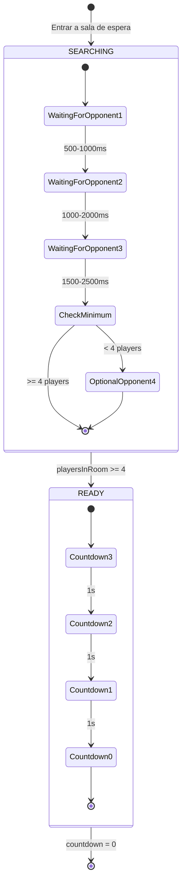
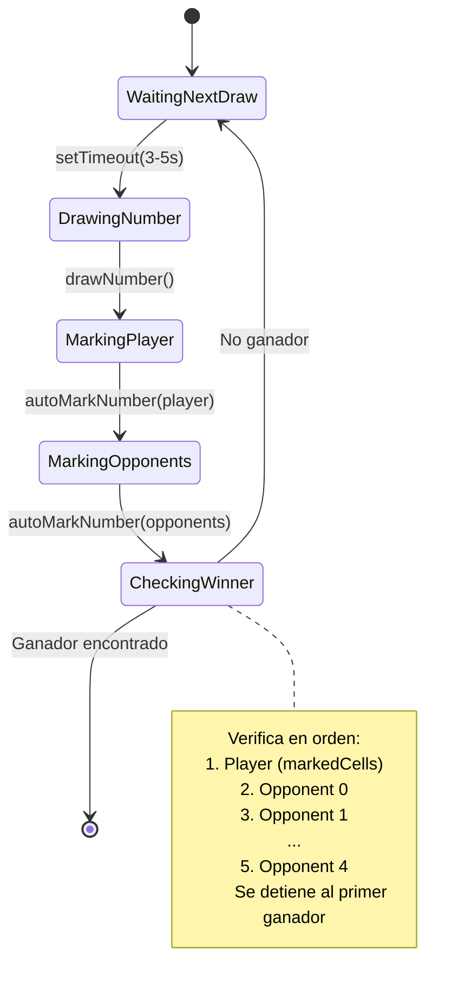

# Diagrama de Estados - Máquina de Estados del Juego Bingo

## Descripción
Este diagrama muestra los estados del juego y las transiciones entre ellos, incluyendo las condiciones y acciones que desencadenan cada transición.

## Diagrama de Estados

```mermaid
stateDiagram-v2
    [*] --> LOBBY: App inicia

    LOBBY --> WAITING: Click "Jugar Ahora"<br/>(playerCredits >= 2)
    LOBBY --> LOBBY: Click "Jugar Ahora"<br/>(playerCredits < 2)<br/>[Mostrar error]

    WAITING --> WAITING: AI opponents se unen<br/>(playersInRoom.length < 4)
    WAITING --> COUNTDOWN: playersInRoom.length >= 4

    COUNTDOWN --> PLAYING: countdown = 0<br/>startGame()

    PLAYING --> PLAYING: drawNextNumber()<br/>cada 3-5 segundos
    PLAYING --> WINNER_DETECTED: checkWinner() = true
    PLAYING --> PLAYING: drawnNumbers.length < 75<br/>!isWinner

    WINNER_DETECTED --> LOBBY: Click "Volver al Lobby"<br/>returnToLobby()

    state LOBBY {
        [*] --> ShowCredits
        ShowCredits --> ValidateCredits: User action
        ValidateCredits --> EnableButton: credits >= 2
        ValidateCredits --> DisableButton: credits < 2
        EnableButton --> [*]
        DisableButton --> [*]
    }

    state WAITING {
        [*] --> InitializeRoom
        InitializeRoom --> AddPlayer: Player joins
        AddPlayer --> SearchingOpponents: playersInRoom = [player]
        SearchingOpponents --> AddAIOpponent1: setTimeout(500-1000ms)
        AddAIOpponent1 --> AddAIOpponent2: setTimeout(1000-2000ms)
        AddAIOpponent2 --> AddAIOpponent3: setTimeout(1500-2500ms)
        AddAIOpponent3 --> CheckMinPlayers
        CheckMinPlayers --> AddMoreOpponents: < 4 players
        CheckMinPlayers --> [*]: >= 4 players
        AddMoreOpponents --> CheckMinPlayers
    }

    state COUNTDOWN {
        [*] --> Three
        Three --> Two: 1 segundo
        Two --> One: 1 segundo
        One --> Zero: 1 segundo
        Zero --> [*]: Trigger startGame()
    }

    state PLAYING {
        [*] --> GenerateCards
        GenerateCards --> SetupAutoDraw: Cartones creados
        SetupAutoDraw --> WaitingForDraw
        WaitingForDraw --> DrawNumber: setTimeout(3-5s)
        DrawNumber --> AutoMarkPlayer: Sortear número
        AutoMarkPlayer --> AutoMarkOpponents: Marcar cartón player
        AutoMarkOpponents --> CheckWinner: Marcar oponentes activos
        CheckWinner --> WaitingForDraw: No hay ganador
        CheckWinner --> [*]: Ganador detectado
    }

    state WINNER_DETECTED {
        [*] --> CalculatePrize
        CalculatePrize --> UpdateCredits: Determinar ganador
        UpdateCredits --> ShowModal: Otorgar premio
        ShowModal --> WaitingUserAction: Mostrar resultado
        WaitingUserAction --> [*]: Click "Volver al Lobby"
    }

    note right of LOBBY
        Estado inicial del juego
        - Muestra créditos actuales
        - Botón "Jugar Ahora" (2 créditos)
        - Valida créditos suficientes
    end note

    note right of WAITING
        Matchmaking simulado
        - Deduce 2 créditos del player
        - AI opponents se unen gradualmente
        - Mínimo 4 jugadores requeridos
        - Máximo 6 jugadores
    end note

    note right of COUNTDOWN
        Cuenta regresiva de 3 segundos
        - Muestra 3, 2, 1
        - Después llama startGame()
        - No se puede cancelar
    end note

    note right of PLAYING
        Juego activo
        - Sorteo automático cada 3-5s
        - Auto-marcado para todos los jugadores
        - Verificación de ganador continua
        - Máximo 75 números
    end note

    note right of WINNER_DETECTED
        Fin del juego
        - Calcula y otorga premio (pot)
        - Muestra modal con ganador
        - Actualiza créditos del ganador
        - Espera confirmación del usuario
    end note
```



## Tabla de Transiciones de Estados

| Estado Origen | Evento/Condición | Estado Destino | Acciones Ejecutadas |
|---------------|------------------|----------------|---------------------|
| LOBBY | Click "Jugar Ahora" + credits >= 2 | WAITING | • initiateMatchmaking()<br/>• Deducir 2 créditos<br/>• setGameState('waiting')<br/>• Agregar player a playersInRoom |
| LOBBY | Click "Jugar Ahora" + credits < 2 | LOBBY | • Mostrar error<br/>• Deshabilitar botón |
| WAITING | AI opponent joins | WAITING | • addAIPlayer(opponentIndex)<br/>• Deducir 2 créditos del AI<br/>• Agregar a playersInRoom |
| WAITING | playersInRoom.length >= 4 | COUNTDOWN | • setCountdown(3) |
| COUNTDOWN | countdown = 0 | PLAYING | • startGame()<br/>• Generar cartones<br/>• Calcular pot<br/>• setGameState('playing') |
| PLAYING | setTimeout(3-5s) | PLAYING | • drawNextNumber()<br/>• Auto-marcar cartones<br/>• checkWinner() |
| PLAYING | checkWinner() = true | WINNER_DETECTED | • setIsWinner(true)<br/>• setWinner(playerIndex)<br/>• Otorgar premio<br/>• setCreditsWon(pot) |
| WINNER_DETECTED | Click "Volver al Lobby" | LOBBY | • returnToLobby()<br/>• Reset game state<br/>• Mantener créditos actualizados |

## Variables de Estado por Fase

### LOBBY
```javascript
{
  gameState: 'lobby',
  bingoCard: null,
  markedCells: [],
  opponentCards: [],
  drawnNumbers: [],
  playersInRoom: [],
  currentPot: 0,
  isWinner: false,
  winner: null,
  playerCredits: 10 // (o valor actual)
}
```

### WAITING
```javascript
{
  gameState: 'waiting',
  bingoCard: null,
  markedCells: [],
  opponentCards: [],
  drawnNumbers: [],
  playersInRoom: [
    { id: 'player', name: 'Tú', isPlayer: true },
    { id: 'opponent-2', name: 'Jugador 3', isPlayer: false, opponentIndex: 2 },
    // ... más jugadores se agregan dinámicamente
  ],
  currentPot: 0,
  isWinner: false,
  winner: null,
  playerCredits: 8 // (10 - 2)
}
```

### COUNTDOWN (subestado de WAITING)
```javascript
{
  gameState: 'waiting',
  countdown: 3, // luego 2, 1, 0
  playersInRoom: [...], // 4-6 jugadores
  // ... resto igual a WAITING
}
```

### PLAYING
```javascript
{
  gameState: 'playing',
  bingoCard: [[...], [...], ...], // 5x5 array
  markedCells: [12, 5, 18, ...], // índices marcados
  opponentCards: [
    [[...], [...], ...], // Opponent 0 cartón
    null,                 // Opponent 1 no en sala
    [[...], [...], ...], // Opponent 2 cartón
    // ...
  ],
  opponentMarkedCells: [
    [12, 5, ...],  // Opponent 0 marcados
    [],            // Opponent 1 no en sala
    [12, 18, ...], // Opponent 2 marcados
    // ...
  ],
  drawnNumbers: [23, 5, 67, 12, ...],
  currentNumber: 42,
  playersInRoom: [...], // 4-6 jugadores
  currentPot: 8, // (4 jugadores × 2 créditos)
  isWinner: false,
  winner: null,
  playerCredits: 8
}
```

### WINNER_DETECTED
```javascript
{
  gameState: 'playing', // No cambia hasta returnToLobby()
  isWinner: true,
  winner: 'player', // o índice del oponente (0-4)
  creditsWon: 8,
  playerCredits: 16, // (8 + 8) si player ganó, o 8 si perdió
  // ... resto mantiene valores del juego
}
```

## Condiciones de Guarda (Guards)

### Transición LOBBY → WAITING
```javascript
// Condición
playerCredits >= BET_AMOUNT (2)

// Verificación en código (lobby.js:10-16)
const canPlay = playerCredits >= betAmount;
if (success) {
  router.push('/waiting');
}
```

### Transición WAITING → COUNTDOWN
```javascript
// Condición
playersInRoom.length >= 4

// Verificación en código (waiting.js:59-63)
if (playersInRoom.length >= 4 && countdown === null) {
  setCountdown(3);
}
```

### Transición PLAYING → WINNER_DETECTED
```javascript
// Condición para Player
checkWinner(markedCells) === true

// Condición para AI Opponent
checkWinner(opponentMarkedCells[i]) === true

// Verificación en código (useBingoGame.js:205-246)
useEffect(() => {
  if (bingoCard && markedCells.length > 0 && !winner) {
    const playerWon = checkWinner(markedCells);
    if (playerWon) {
      setIsWinner(true);
      setWinner('player');
      // ...
    }
    // Verificar oponentes...
  }
}, [markedCells, opponentMarkedCells, bingoCard, winner]);
```

## Eventos y Acciones

### Eventos del Usuario
1. **Click "Jugar Ahora"** → Trigger: `initiateMatchmaking()`
2. **Click celda del cartón** → Trigger: `toggleCell(cellIndex)`
3. **Click "Volver al Lobby"** → Trigger: `returnToLobby()` + navegación

### Eventos del Sistema
1. **setTimeout (AI join)** → Trigger: `addAIPlayer(opponentIndex)`
2. **setTimeout (countdown)** → Trigger: `setCountdown(prev - 1)`
3. **setTimeout (auto-draw)** → Trigger: `drawNextNumber()`

### Acciones por Transición

#### LOBBY → WAITING
```javascript
// Acciones ejecutadas
1. setPlayerCredits(prev => prev - BET_AMOUNT)
2. setGameState(GAME_STATES.WAITING)
3. setPlayersInRoom([{ id: 'player', name: 'Tú', isPlayer: true }])
4. router.push('/waiting')
```

#### WAITING → PLAYING
```javascript
// Acciones ejecutadas
1. setCurrentPot(playersInRoom.length × BET_AMOUNT)
2. setGameState(GAME_STATES.PLAYING)
3. generateBingoCard() → setBingoCard()
4. generateBingoCard() × N para opponents
5. setMarkedCells([FREE_CELL_POSITION])
6. setOpponentMarkedCells([...])
7. setDrawnNumbers([])
8. router.replace('/game')
```

#### PLAYING → WINNER_DETECTED
```javascript
// Acciones ejecutadas cuando player gana
1. setIsWinner(true)
2. setWinner('player')
3. setPlayerCredits(prev => prev + currentPot)
4. setCreditsWon(currentPot)

// Acciones ejecutadas cuando AI gana
1. setIsWinner(true)
2. setWinner(opponentIndex)
3. setOpponentCredits[i] += currentPot
4. setCreditsWon(currentPot)
```

#### WINNER_DETECTED → LOBBY
```javascript
// Acciones ejecutadas
1. setGameState(GAME_STATES.LOBBY)
2. setPlayersInRoom([])
3. setBingoCard(null)
4. setMarkedCells([])
5. setOpponentCards([])
6. setOpponentMarkedCells([])
7. setDrawnNumbers([])
8. setCurrentNumber(null)
9. setWinner(null)
10. setIsWinner(false)
11. setCreditsWon(0)
12. setCurrentPot(0)
13. router.push('/lobby')

// NOTA: playerCredits NO se resetea (mantiene premio)
```

## Invariantes de Estado

### Por Estado

**LOBBY**
- ✅ `bingoCard === null`
- ✅ `playersInRoom.length === 0`
- ✅ `currentPot === 0`
- ✅ `isWinner === false`

**WAITING**
- ✅ `bingoCard === null`
- ✅ `playersInRoom.length >= 1`
- ✅ `playersInRoom[0].id === 'player'`
- ✅ `currentPot === 0`

**PLAYING**
- ✅ `bingoCard !== null`
- ✅ `playersInRoom.length >= 4`
- ✅ `currentPot > 0`
- ✅ `gameState === 'playing'`
- ✅ `drawnNumbers.length <= 75`

**WINNER_DETECTED**
- ✅ `isWinner === true`
- ✅ `winner !== null`
- ✅ `creditsWon > 0`

## Subestados y Composición

### WAITING tiene 2 fases internas



### PLAYING tiene loop de auto-sorteo



## Casos Especiales y Manejo de Errores

### Error: Créditos Insuficientes
```mermaid
stateDiagram-v2
    LOBBY --> LOBBY: playerCredits < 2

    state LOBBY {
        note right of LOBBY
            Acción:
            - Deshabilitar botón "Jugar Ahora"
            - Mostrar mensaje:
              "Necesitas al menos 2 créditos"
        end note
    }
```

### Error: Sin Oponentes Disponibles
```mermaid
stateDiagram-v2
    WAITING --> WAITING: Ningún AI con créditos

    state WAITING {
        note right of WAITING
            Acción:
            - addAIPlayer() retorna false
            - playersInRoom.length = 1
            - Juego no inicia
            - Usuario debe esperar o salir
        end note
    }
```

### Error: Acceso Directo a /game
```mermaid
stateDiagram-v2
    [*] --> PLAYING: URL directa /game
    PLAYING --> LOBBY: bingoCard === null

    state PLAYING {
        note right of PLAYING
            Verificación en render:
            if (!bingoCard || gameState !== 'playing') {
                return <Redirect href="/lobby" />
            }
        end note
    }
```

## Timing del Sistema

### Diagrama de Tiempos

```
LOBBY
  ↓ (instantáneo)
WAITING
  ├─ 500-1000ms  → AI Opponent 1 joins
  ├─ 1000-2000ms → AI Opponent 2 joins
  ├─ 1500-2500ms → AI Opponent 3 joins
  ├─ 2000-3000ms → AI Opponent 4 joins (70% probabilidad)
  └─ 2500-3500ms → AI Opponent 5 joins (40% probabilidad)
  ↓ (cuando >= 4 players)
COUNTDOWN
  ├─ 0s   → "3"
  ├─ 1s   → "2"
  ├─ 2s   → "1"
  └─ 3s   → startGame()
  ↓
PLAYING
  ├─ 3-5s  → Número 1 sorteado
  ├─ 3-5s  → Número 2 sorteado
  ├─ 3-5s  → Número 3 sorteado
  └─ ... (hasta ganador o 75 números)
  ↓
WINNER_DETECTED
  └─ Espera acción del usuario
  ↓
LOBBY (vuelta al inicio)
```

**Tiempo total estimado por partida:**
- Waiting: 2-5 segundos
- Countdown: 3 segundos
- Playing: 30-90 segundos (depende de cuántos números hasta ganar)
- **Total**: ~40-100 segundos por partida

## Persistencia de Datos entre Estados

### Datos que SE mantienen
- ✅ `playerCredits` - Persiste durante todo el ciclo
- ✅ `opponentCredits` - Persiste durante todo el ciclo

### Datos que SE resetean en returnToLobby()
- ❌ `bingoCard`
- ❌ `markedCells`
- ❌ `opponentCards`
- ❌ `opponentMarkedCells`
- ❌ `drawnNumbers`
- ❌ `currentNumber`
- ❌ `playersInRoom`
- ❌ `currentPot`
- ❌ `isWinner`
- ❌ `winner`
- ❌ `creditsWon`

## Arquitectura de Código para Estados

### Ubicación del State Machine
**Archivo**: `hooks/useBingoGame.js:16-21`

```javascript
const GAME_STATES = {
  LOBBY: 'lobby',
  WAITING: 'waiting',
  PLAYING: 'playing',
  COMPLETED: 'completed', // Reservado para futuro
};
```

### Funciones de Transición

| Función | Transición | Ubicación |
|---------|------------|-----------|
| `initiateMatchmaking()` | LOBBY → WAITING | useBingoGame.js:119-127 |
| `addAIPlayer(n)` | WAITING → WAITING | useBingoGame.js:130-162 |
| `startGame()` | COUNTDOWN → PLAYING | useBingoGame.js:165-190 |
| `drawNextNumber()` | PLAYING → PLAYING | useBingoGame.js:88-109 |
| `returnToLobby()` | WINNER → LOBBY | useBingoGame.js:193-206 |

## Verificación de Integridad del Estado

### Reglas de Negocio Verificadas

1. **No doble deducción de créditos**
   - ✅ Créditos se deducen solo al iniciar matchmaking
   - ✅ No se deducen al iniciar juego (ya fueron deducidos)

2. **No duplicar jugadores**
   - ✅ `addAIPlayer()` verifica `alreadyInRoom` antes de agregar
   - ✅ Usa `opponentIndex` único por jugador

3. **Solo auto-marcar cartones activos**
   - ✅ Verifica `if (opponentCards[index])` antes de auto-marcar
   - ✅ Evita null reference errors

4. **Un solo ganador**
   - ✅ Verificación se detiene al primer ganador detectado
   - ✅ `winner !== null` previene múltiples ganadores

5. **Pot correcto**
   - ✅ `pot = playersInRoom.length × BET_AMOUNT`
   - ✅ Se calcula al iniciar juego, no cambia durante partida

## Estado Global (Context API)

Todo el estado se comparte globalmente vía `BingoGameContext`:

```javascript
// contexts/BingoGameContext.js
<BingoGameProvider>
  {/* Todos los screens acceden al mismo estado */}
  <Stack>
    <Screen name="lobby" />
    <Screen name="waiting" />
    <Screen name="game" />
  </Stack>
</BingoGameProvider>
```

Esto previene:
- ❌ Pérdida de estado al navegar
- ❌ Duplicación de lógica
- ❌ Inconsistencias entre pantallas
